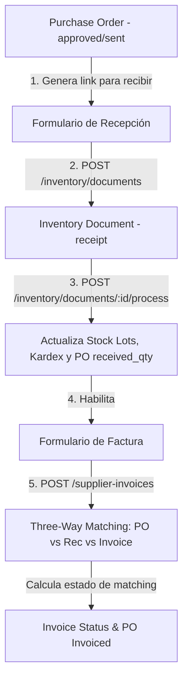

# Plan de Implementación: Milestone 28 (M28-SRM) — Recepción contra PO y Three-Way Matching

Este documento presenta el diseño técnico y el plan de implementación detallado para el **Milestone 28 (M28-SRM)**, integrando el flujo de recepción de inventario con las Órdenes de Compra (PO) y habilitando la conciliación de tres vías (Three-Way Matching) con las facturas de proveedores.

---

## Goal Description

El objetivo es cerrar el ciclo operativo de compras y asegurar que:
1. **Recepción contra PO:** La mercancía ingresada al almacén se registre formalmente contra una orden de compra, deduciendo cantidades pendientes en la PO y actualizando los estados correspondientes (`partially_received`, `received`).
2. **Three-Way Matching:** Se registren las facturas de proveedores vinculadas a una PO y su recepción correspondiente. El sistema comparará automáticamente cantidades y costos unitarios de las tres fuentes (PO, Recepción, Factura) y alertará sobre discrepancias que superen una tolerancia configurable (por defecto 2.0%).

---

## User Review Required

> [!IMPORTANT]
> **Modificaciones a Tablas Existentes:**
> Se realizarán `ALTER TABLE` sobre `inventory_documents` e `inventory_document_lines`. Esto requiere cuidado en producción para no romper registros anteriores. Se usarán valores por defecto `NULL` para compatibilidad hacia atrás.
>
> **Configuración de Tolerancia:**
> Agregaremos la columna `matching_tolerance_pct` a `po_approval_config`. Por defecto se establecerá en `2.0` (2%). Si deseas otra tolerancia inicial, infórmame.

---

## Open Questions

> [!NOTE]
> * **¿Las facturas recibidas de proveedores pueden registrarse sin asociar una orden de compra?**  
>   *Diseño propuesto:* Sí, la base de datos permitirá `po_id` y `receipt_id` como opcionales (`NULL`), pero el flujo principal del Three-Way Matching requiere ambos para calcular las discrepancias. Si se omiten, el estado de matching quedará directamente como `matched` o `pending` de forma genérica.
> * **¿Se debe bloquear la exportación a Odoo si hay un `mismatch` en la factura?**  
>   *Diseño propuesto:* No se bloqueará críticamente en base de datos, pero el frontend mostrará una advertencia fuerte (`WARNING`) en amarillo/rojo y se registrará la justificación en `matching_notes`.

---

## Proposed Changes



### 1. Base de Datos (Migración SQL)

#### [NEW] `backend/migrations/053_srm_reception_matching.sql`
Esta migración altera las tablas de documentos de inventario y crea las tablas para facturación y conciliación.

```sql
-- 1. Modificar tablas de inventario existentes para soportar el vínculo con PO
ALTER TABLE public.inventory_documents 
  ADD COLUMN po_id UUID REFERENCES public.purchase_orders(id) ON DELETE SET NULL,
  ADD COLUMN supplier_id UUID REFERENCES public.suppliers(id) ON DELETE SET NULL;

ALTER TABLE public.inventory_document_lines
  ADD COLUMN po_qty_ordered_base NUMERIC(18, 6),
  ADD COLUMN po_line_id UUID REFERENCES public.purchase_order_lines(id) ON DELETE SET NULL,
  ADD COLUMN discrepancy_base NUMERIC(18, 6);

-- 2. Agregar la tolerancia de matching en la configuración de PO
ALTER TABLE public.po_approval_config
  ADD COLUMN matching_tolerance_pct NUMERIC(5, 2) DEFAULT 2.0 NOT NULL;

-- 3. Crear tabla de facturas de proveedores
CREATE TABLE IF NOT EXISTS public.supplier_invoices (
  id              UUID DEFAULT uuid_generate_v4() PRIMARY KEY,
  org_id          UUID REFERENCES public.organizations(id) ON DELETE CASCADE NOT NULL,
  supplier_id     UUID REFERENCES public.suppliers(id) ON DELETE RESTRICT NOT NULL,
  po_id           UUID REFERENCES public.purchase_orders(id) ON DELETE SET NULL,
  receipt_id      UUID REFERENCES public.inventory_documents(id) ON DELETE SET NULL,
  invoice_number  TEXT NOT NULL,
  invoice_date    DATE NOT NULL,
  due_date        DATE,
  currency        TEXT DEFAULT 'USD' NOT NULL,
  subtotal        NUMERIC(18,2) NOT NULL,
  tax_amount      NUMERIC(18,2) DEFAULT 0 NOT NULL,
  total           NUMERIC(18,2) NOT NULL,
  matching_status TEXT CHECK (matching_status IN ('pending', 'matched', 'partial_match', 'mismatch')) DEFAULT 'pending' NOT NULL,
  matching_notes  TEXT,
  payment_status  TEXT CHECK (payment_status IN ('unpaid', 'exported', 'paid')) DEFAULT 'unpaid' NOT NULL,
  exported_at     TIMESTAMP WITH TIME ZONE,
  pdf_url         TEXT,
  created_by      UUID REFERENCES public.profiles(id) ON DELETE SET NULL,
  created_at      TIMESTAMP WITH TIME ZONE DEFAULT now() NOT NULL,
  UNIQUE (org_id, supplier_id, invoice_number)
);

-- 4. Crear tabla de líneas de facturas de proveedores
CREATE TABLE IF NOT EXISTS public.supplier_invoice_lines (
  id                    UUID DEFAULT uuid_generate_v4() PRIMARY KEY,
  invoice_id            UUID REFERENCES public.supplier_invoices(id) ON DELETE CASCADE NOT NULL,
  po_line_id            UUID REFERENCES public.purchase_order_lines(id) ON DELETE SET NULL,
  item_id               UUID REFERENCES public.items(id) ON DELETE RESTRICT NOT NULL,
  qty_invoiced_base     NUMERIC(18,6) NOT NULL CHECK (qty_invoiced_base >= 0),
  unit_cost_base        NUMERIC(18,6) NOT NULL CHECK (unit_cost_base >= 0),
  line_total            NUMERIC(18,2) NOT NULL,
  diff_vs_po_base       NUMERIC(18,6),
  diff_vs_receipt_base  NUMERIC(18,6)
);

-- 5. Habilitar RLS
ALTER TABLE public.supplier_invoices ENABLE ROW LEVEL SECURITY;
ALTER TABLE public.supplier_invoice_lines ENABLE ROW LEVEL SECURITY;

-- 6. Crear políticas permisivas por defecto para usuarios autenticados
DROP POLICY IF EXISTS "Authenticated users can do everything" ON public.supplier_invoices;
CREATE POLICY "Authenticated users can do everything" ON public.supplier_invoices FOR ALL TO authenticated USING (true) WITH CHECK (true);

DROP POLICY IF EXISTS "Authenticated users can do everything" ON public.supplier_invoice_lines;
CREATE POLICY "Authenticated users can do everything" ON public.supplier_invoice_lines FOR ALL TO authenticated USING (true) WITH CHECK (true);

-- 7. Crear índices
CREATE INDEX IF NOT EXISTS idx_invoices_supplier ON public.supplier_invoices(supplier_id, payment_status);
CREATE INDEX IF NOT EXISTS idx_invoices_due ON public.supplier_invoices(due_date) WHERE payment_status != 'paid';
CREATE INDEX IF NOT EXISTS idx_invoices_po ON public.supplier_invoices(po_id);
CREATE INDEX IF NOT EXISTS idx_invoice_lines_invoice ON public.supplier_invoice_lines(invoice_id);

-- 8. Insertar permisos
INSERT INTO public.permissions (module, action, key, description) VALUES
  ('purchasing', 'invoice', 'purchasing.invoice', 'Registrar facturas de proveedores'),
  ('purchasing', 'pay', 'purchasing.pay', 'Programar pagos y marcar facturas como pagadas')
ON CONFLICT (key) DO NOTHING;
```

---

### 2. Backend (FastAPI)

#### [MODIFY] `backend/app/inventory/schemas.py`
Extender esquemas de entrada y respuesta de documentos de inventario.
* Agregar `po_id` y `supplier_id` (Opcionales) a `InventoryDocumentCreate`, `InventoryDocumentUpdate` e `InventoryDocumentResponse`.
* Agregar `po_qty_ordered_base`, `po_line_id` y `discrepancy_base` a `InventoryDocumentLineSchema` e `InventoryDocumentLineResponse`.

#### [MODIFY] `backend/app/inventory/router.py`
* En `create_inventory_document` (`POST /inventory/documents`):
  * Capturar `po_id` y `supplier_id` y guardarlos en la cabecera.
  * Para cada línea, si se especifica `po_line_id`, buscar los datos de la PO Line correspondientes. Almacenar `po_qty_ordered_base` y calcular `discrepancy_base = qty_base - po_qty_ordered_base`.
* En `process_inventory_document` (`POST /inventory/documents/{id}/process`):
  * Al confirmar una recepción (`receipt`) que posee `po_id`:
    * Actualizar las cantidades acumuladas recibidas en la base de datos para cada línea asociada de PO:
      * `new_received_base = current_received_base + qty_base`
      * `new_pending_base = max(0.0, qty_ordered_base - new_received_base)`
      * `status = 'received'` si `new_pending_base <= 0` sino `'partially_received'`.
    * Evaluar el estado global de la PO:
      * Si todas las líneas tienen estatus `received` o `cancelled` -> PO `status = 'received'`.
      * Si al menos una línea tiene cantidad recibida > 0 -> PO `status = 'partially_received'`.

#### [MODIFY] `backend/app/purchasing/schemas.py`
Añadir nuevos esquemas de validación de Pydantic.
* `SupplierInvoiceLineCreate` y `SupplierInvoiceLineResponse`.
* `SupplierInvoiceCreate`, `SupplierInvoiceResponse`.
* Extender `POApprovalConfigResponse` y `POApprovalConfigUpdate` para incluir `matching_tolerance_pct`.

#### [MODIFY] `backend/app/purchasing/router.py`
* Actualizar GET/PUT de `/po-approval-config/{org_id}` para manejar `matching_tolerance_pct` (por defecto `2.0`).
* Implementar nuevos endpoints de facturación:
  * `POST /supplier-invoices` -> Registra la factura, calcula la conciliación de 3 vías:
    * Obtiene la configuración de la organización para extraer la tolerancia de matching.
    * Valida si el costo unitario y cantidad recibida/pedida difieren en un porcentaje mayor al tolerado.
    * Asigna el `matching_status` (`matched`, `partial_match` o `mismatch`).
    * Si la conciliación no es un `mismatch`, actualiza el estatus de la PO asociada a `invoiced`.
  * `GET /supplier-invoices` -> Lista de facturas filtrable por `supplier_id` o `payment_status`.
  * `GET /supplier-invoices/{id}` -> Retorna el detalle con líneas y desglose comparativo de matching.
  * `PATCH /supplier-invoices/{id}/mark-exported` -> Actualiza `payment_status` a `exported` y marca timestamp.
  * `PATCH /supplier-invoices/{id}/mark-paid` -> Actualiza `payment_status` a `paid`.

---

### 3. Frontend (Next.js & Tailwind CSS)

#### [MODIFY] `frontend/src/lib/api/purchasing.ts`
Agregar llamadas API clientes:
```typescript
createSupplierInvoice: (data: SupplierInvoiceCreate): Promise<SupplierInvoiceResponse> =>
    fetchWithAuth('/supplier-invoices', { method: 'POST', body: JSON.stringify(data) }),

getSupplierInvoices: (filters?: { supplier_id?: string; payment_status?: string }): Promise<SupplierInvoiceResponse[]> => {
    const params = new URLSearchParams();
    if (filters?.supplier_id) params.append('supplier_id', filters.supplier_id);
    if (filters?.payment_status) params.append('payment_status', filters.payment_status);
    return fetchWithAuth(`/supplier-invoices?${params.toString()}`);
},

getSupplierInvoice: (id: string): Promise<SupplierInvoiceResponse> =>
    fetchWithAuth(`/supplier-invoices/${id}`),

markInvoiceExported: (id: string): Promise<SupplierInvoiceResponse> =>
    fetchWithAuth(`/supplier-invoices/${id}/mark-exported`, { method: 'PATCH' }),

markInvoicePaid: (id: string): Promise<SupplierInvoiceResponse> =>
    fetchWithAuth(`/supplier-invoices/${id}/mark-paid`, { method: 'PATCH' }),
```

#### [MODIFY] `frontend/src/app/admin/purchasing/orders/[id]/page.tsx`
* Agregar botón **"Registrar Recepción"** (visible si `po.status` es `sent` o `partially_received`). Redirige a `/admin/purchasing/orders/[id]/receive`.
* Agregar botón **"Registrar Factura"** (visible si `po.status` es `sent`, `partially_received` o `received`). Redirige a `/admin/purchasing/invoices/new?po_id=[id]`.

#### [NEW] `frontend/src/app/admin/purchasing/orders/[id]/receive/page.tsx`
* Formulario móvil e intuitivo que carga las líneas de la orden de compra.
* Muestra cantidad pedida vs. ya recibida.
* Permite ingresar: **Cantidad Recibida**, **Lote**, y **Fecha de Vencimiento** por línea.
* Muestra advertencia en tiempo real si la cantidad recibida difiere de la cantidad pedida.
* Al confirmar, crea un documento de inventario de tipo `receipt` y lo procesa automáticamente.

#### [NEW] `frontend/src/app/admin/purchasing/invoices/page.tsx`
* Vista de facturas registradas. Tabla con:
  * Número de Factura.
  * Proveedor.
  * Fecha de Factura y de Vencimiento.
  * Total.
  * Badge de Conciliación (`matched` verde, `partial_match` amarillo, `mismatch` rojo).
  * Badge de Pago (`unpaid` gris, `exported` azul, `paid` verde).

#### [NEW] `frontend/src/app/admin/purchasing/invoices/new/page.tsx`
* Formulario para registrar factura de proveedor.
* Carga automáticamente los datos de la PO seleccionada y su recepción asociada (`receipt_id`).
* El usuario digita el número físico de la factura, fecha de emisión, y confirma las cantidades/costos facturados por línea.
* Envía la información al backend para guardar y gatillar el matching automático.

#### [NEW] `frontend/src/app/admin/purchasing/invoices/[id]/page.tsx`
* Detalle de la factura con la tabla comparativa de Three-Way Matching:
  * Compara por cada ítem: Cantidad/Costo de la PO vs. Cantidad/Costo Recibidos vs. Cantidad/Costo Facturados.
  * Resalta las líneas de discrepancia con estilos visuales premium de Shadcn/UI y alertas visuales claras.
  * Botones para marcar como Exportada a Odoo o Pagada.

#### [MODIFY] `frontend/src/app/admin/layout.tsx`
* Agregar enlace de menú **"Facturas"** (`/admin/purchasing/invoices`) dentro de la sección "Compras".

#### [MODIFY] `frontend/src/app/admin/settings/purchasing/page.tsx`
* Agregar un input numérico para la tolerancia de conciliación (`matching_tolerance_pct`) y sincronizar con la API.

---

## Verification Plan

### Automated Tests (TDD Strategy)

Crearemos un nuevo set de pruebas automatizadas en `backend/tests/test_m28_reception_matching.py` con las siguientes validaciones:

1. **`test_create_receipt_linked_to_po`**: Verifica que al crear un `inventory_document` con tipo `receipt` y asociarlo a un `po_id`, las líneas se enlacen a los `po_line_id` y calculen discrepancias base correctamente.
2. **`test_process_receipt_updates_po_quantities`**: Valida que al procesar una recepción, las líneas de la PO actualicen su `qty_received_base` y `qty_pending_base`, y que el estatus global de la PO cambie a `partially_received` o `received`.
3. **`test_register_invoice_matched`**: Registra una factura idéntica en cantidades y costos a la PO/Recepción y comprueba que el `matching_status` resulte en `'matched'` y el estado de la PO cambie a `'invoiced'`.
4. **`test_register_invoice_mismatch_exceeding_tolerance`**: Registra una factura con un costo unitario con una diferencia superior al 2.0% tolerado y verifica que el `matching_status` calculado sea `'mismatch'`.

Para ejecutar las pruebas:
```powershell
# En la raíz del backend
pytest tests/test_m28_reception_matching.py -v
```

### Manual Verification

1. **Flujo de Recepción:**
   * Crear una PO, aprobarla y marcarla como enviada.
   * Ir a la página de detalles de la PO y hacer clic en **"Registrar Recepción"**.
   * Introducir cantidades (ejemplo: recibir 9 de 10 unidades). Confirmar la recepción.
   * Verificar en el Kardex y en el detalle de la PO que el stock se incrementó, el lote se creó y el estado de la PO cambió a **Partially Received**.

2. **Flujo de Facturación y Matching:**
   * En la misma PO, presionar **"Registrar Factura"**.
   * Rellenar los campos requeridos y en el desglose de líneas introducir valores idénticos a los recibidos. Guardar.
   * Visualizar la factura en `/admin/purchasing/invoices/[id]` y verificar que el badge de conciliación sea **MATCHED** (verde).
   * Registrar otra factura ingresando un costo unitario significativamente mayor al acordado en la PO. Guardar y verificar que muestre el badge **MISMATCH** (rojo) indicando claramente la desviación.
