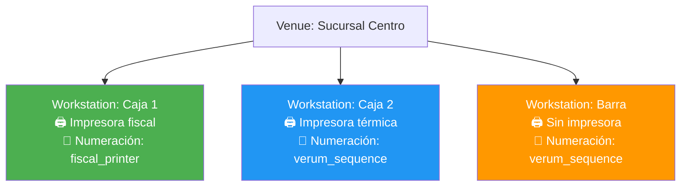
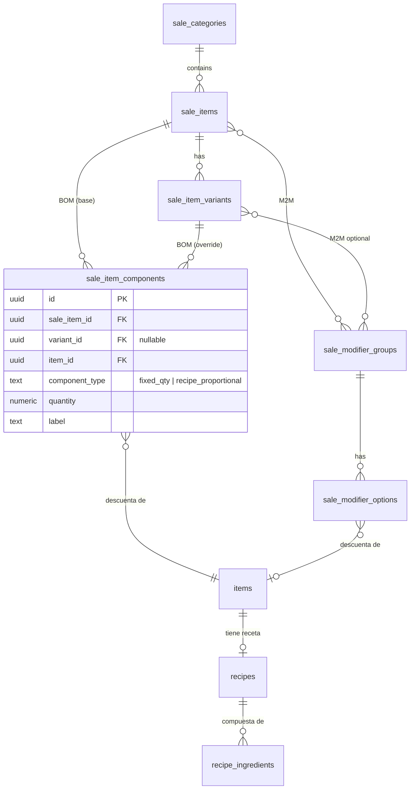
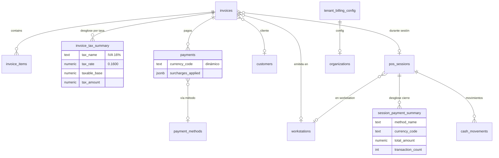

# SPEC: Verum ERP — Módulo de Ventas y Facturación

> **Versión**: 3.0 (Consolidado)  
> **Fecha**: 2026-08-18  
> **Estado**: Draft — Pendiente de aprobación final

---

## Tabla de Contenidos

1. [Objetivo y Alcance](#1-objetivo-y-alcance)
2. [Principios de Diseño](#2-principios-de-diseño)
3. [Conceptos Clave](#3-conceptos-clave)
4. [Escenarios Reales de Deducción](#4-escenarios-reales-de-deducción)
5. [Tablas — DDL Completo](#5-tablas--ddl-completo)
6. [Diagramas ER](#6-diagramas-er)
7. [Lógica de Negocio](#7-lógica-de-negocio)
8. [Módulo FastAPI](#8-módulo-fastapi)
9. [Permisos](#9-permisos)
10. [Datos Seed](#10-datos-seed)
11. [Vinculación con Catering](#11-vinculación-con-catering)
12. [Mapeo con VerumQuick](#12-mapeo-con-verumquick)
13. [Plan de Implementación](#13-plan-de-implementación)

---

## 1. Objetivo y Alcance

### Lo que SÍ incluye

| Área | Detalle |
|------|---------|
| **Catálogo de venta** | Productos vendibles, variantes, modificadores, categorías de menú |
| **BOM de venta** | Componentes por sale_item para deducción de inventario flexible |
| **Clientes** | Datos fiscales, crédito, retenciones |
| **Facturación** | Facturas, notas de crédito/débito, numeración fiscal |
| **Pagos** | Multi-método, multi-moneda, surcharges dinámicos |
| **Impuestos** | Multi-tasa por factura con desglose individual |
| **Listas de precios** | Precios configurables, opcionalmente por sucursal |
| **Configuración** | Workstations, métodos de pago, surcharges, config fiscal |
| **Stubs POS** | Tablas vacías para POS futuro (sin lógica) |
| **Stub KDS Servicio** | Tabla vacía para kitchen display de servicio (sin lógica) |

### Lo que NO incluye

| Área | Razón |
|------|-------|
| Módulo POS completo | Solo se crean las tablas; lógica y UI se harán después |
| KDS de Servicio (lógica) | Solo stub |
| Webhooks / Integración VerumQuick | Fase posterior |
| Interfaz Next.js de ventas | Solo backend (API + BD) |
| Reportes fiscales | Se construirán sobre la data existente |

---

## 2. Principios de Diseño

| Principio | Detalle |
|-----------|---------|
| **Multi-moneda puro** | Cero códigos de moneda hardcodeados. Ni `'USD'`, ni `'VES'`, ni `if currency != 'X'`. Todo se configura por tenant. |
| **Multi-impuesto** | Una factura puede tener líneas con tasas diferentes (16%, 22%, exento). El desglose es por tasa, nunca sumado en un solo campo. |
| **Inventario configurable** | La deducción se define por componentes a nivel de artículo de venta, no por flag global. |
| **Estaciones de trabajo** | La impresión fiscal y numeración se configura por estación (workstation), no por sucursal. |
| **Surcharges configurables** | IGTF y cualquier recargo futuro son surcharges dinámicos vinculados a **métodos de pago**, no a monedas. |
| **País-agnóstico** | No se asume Venezuela, Chile, Colombia, ni ningún país. Todo es configurable. |

---

## 3. Conceptos Clave

### 3.1 BOM de Venta (`sale_item_components`)

Cada `sale_item` (o variante) tiene una lista de **componentes** que define exactamente qué se descuenta del inventario al vender. Esto reemplaza cualquier campo `deduction_strategy` simple.

| `component_type` | Qué hace | `quantity` significa | Ejemplo |
|-------------------|----------|---------------------|---------|
| `fixed_qty` | Descuenta una cantidad fija del item del stock | Unidades a descontar por unidad vendida | 1 caja, 1 cachito, 2 panes |
| `recipe_proportional` | Descuenta una fracción de los ingredientes de la receta del item | Fracción de la receta completa | 0.125 = 1/8 de pizza, 1.0 = receta completa |

Si un `sale_item` **no tiene components**, no descuenta inventario (servicios, combos virtuales, etc.).

### 3.2 Workstations

Una sucursal puede tener múltiples estaciones de trabajo, cada una con su configuración de impresión y numeración:



### 3.3 Desglose de Impuestos

En lugar de un solo campo `tax_amount`, cada factura tiene una tabla pivote `invoice_tax_summary`:

```
Factura FAC-00000042
├── Línea 1: Hamburguesa (IVA 16%)  → subtotal: $10.00, tax: $1.60
├── Línea 2: Cerveza (IVA 22%)      → subtotal: $5.00,  tax: $1.10
├── Línea 3: Agua (Exento)          → subtotal: $2.00,  tax: $0.00
│
├── Tax Summary:
│   ├── IVA 16%: base $10.00, tax $1.60
│   ├── IVA 22%: base $5.00,  tax $1.10
│   └── Exento:  base $2.00,  tax $0.00
│
└── Total: $19.70
```

### 3.4 Surcharges Dinámicos

Los surcharges (como IGTF) se vinculan a **métodos de pago**, no a monedas. El tenant decide qué métodos llevan surcharge:

```
tenant_billing_config.surcharges = [
  {
    "name": "IGTF",
    "rate": 0.03,
    "is_active": true,
    "apply_to_payment_methods": ["uuid-zelle", "uuid-efectivo-divisas"]
  }
]
```

Al registrar un pago con "Zelle", el sistema calcula: `monto × 0.03 = surcharge`.  
Al registrar un pago con "Pago Móvil" (no está en la lista), no aplica surcharge.

---

## 4. Escenarios Reales de Deducción

### Escenario 1: Slice de Pizza Dolce Diavola 45cm

```
Item de inventario: "Pizza Dolce Diavola 45cm" (type: finished)
  └─ Recipe (yield: 1 pizza):
       - 350g masa, 120g salsa, 200g mozzarella, 80g pepperoni, 15g orégano

Sale Item: "Slice de Pizza Dolce Diavola"
  └─ Components:
       │ item: "Pizza Dolce Diavola 45cm"
       │ type: recipe_proportional
       │ quantity: 0.125  (= 1/8 de la receta)

Al vender 3 slices → descuenta:
  masa:       350g × 0.125 × 3 = 131.25g
  salsa:      120g × 0.125 × 3 = 45.00g
  mozzarella: 200g × 0.125 × 3 = 75.00g
  pepperoni:   80g × 0.125 × 3 = 30.00g
  orégano:     15g × 0.125 × 3 = 5.625g
```

### Escenario 2: Pizza 33cm completa + caja

```
Sale Item: "Pizza Dolce Diavola 33cm para llevar"
  └─ Components:
       │ 1. item: "Pizza Dolce Diavola 33cm"  │ type: recipe_proportional │ qty: 1.0
       │ 2. item: "Caja Pizza 33cm"            │ type: fixed_qty          │ qty: 1

Al vender 1 → descuenta ingredientes completos de la receta + 1 caja
```

### Escenario 3: Hamburguesa + Papas

```
Sale Item: "Hamburguesa X con Papas"
  └─ Components:
       │ 1. item: "Hamburguesa Clásica"      │ type: recipe_proportional │ qty: 1.0
       │ 2. item: "Ración de Papas Fritas"   │ type: recipe_proportional │ qty: 1.0

Al vender 1 → descuenta ingredientes de la receta de hamburguesa
             + ingredientes de la receta de papas
```

### Escenario 4: Cachito de panadería

```
Sale Item: "Cachito de Jamón"
  └─ Components:
       │ item: "Cachito de Jamón"  │ type: fixed_qty │ qty: 1

Al vender 1 → descuenta 1 cachito del stock
(los ingredientes ya se descontaron al producir con production_order)
```

### Escenario 5: Servicio sin inventario

```
Sale Item: "Servicio de Decoración"
  └─ Components: (ninguno)

Al vender → no descuenta nada
```

### Variantes con deducción diferente

```
Sale Item: "Pizza Dolce Diavola" (has_variants: true)
  ├─ Variant: "33cm" ($12)
  │    └─ Components:
  │         │ 1. "Pizza DD 33cm"  │ recipe_proportional │ qty: 1.0
  │         │ 2. "Caja 33cm"      │ fixed_qty           │ qty: 1
  │
  ├─ Variant: "45cm" ($18)
  │    └─ Components:
  │         │ 1. "Pizza DD 45cm"  │ recipe_proportional │ qty: 1.0
  │         │ 2. "Caja 45cm"      │ fixed_qty           │ qty: 1
  │
  └─ Variant: "Slice 45cm" ($3)
       └─ Components:
            │ 1. "Pizza DD 45cm"  │ recipe_proportional │ qty: 0.125
```

---

## 5. Tablas — DDL Completo

### 5.1 Configuración del Tenant

#### `tenant_billing_config`

```sql
CREATE TABLE tenant_billing_config (
    id              UUID DEFAULT uuid_generate_v4() PRIMARY KEY,
    org_id          UUID REFERENCES organizations(id) ON DELETE CASCADE NOT NULL UNIQUE,
    
    default_tax_id  UUID REFERENCES taxes(id) ON DELETE SET NULL,
    
    -- Surcharges configurables, vinculados a métodos de pago
    surcharges      JSONB DEFAULT '[]'::jsonb,
    /*
    [
      {
        "name": "IGTF",
        "rate": 0.03,
        "is_active": true,
        "apply_to_payment_methods": ["uuid-1", "uuid-2"],
        "description": "Impuesto a Grandes Transacciones Financieras"
      }
    ]
    */
    
    withholding_enabled BOOLEAN DEFAULT FALSE,
    
    rounding_mode   TEXT CHECK (rounding_mode IN (
        'none', 'round_half_up', 'round_up', 'round_down'
    )) DEFAULT 'round_half_up',
    rounding_precision INTEGER DEFAULT 2,
    
    invoice_footer  TEXT,
    invoice_notes   TEXT,
    
    created_at      TIMESTAMP WITH TIME ZONE DEFAULT NOW(),
    updated_at      TIMESTAMP WITH TIME ZONE DEFAULT NOW()
);
```

#### `payment_methods`

```sql
CREATE TABLE payment_methods (
    id              UUID DEFAULT uuid_generate_v4() PRIMARY KEY,
    org_id          UUID REFERENCES organizations(id) ON DELETE CASCADE NOT NULL,
    name            TEXT NOT NULL,
    method_type     TEXT CHECK (method_type IN (
        'cash', 'card', 'bank_transfer', 'mobile_payment',
        'digital_wallet', 'crypto', 'other'
    )) NOT NULL,
    currency_code   TEXT,              -- NULL = acepta cualquier moneda
    instructions    TEXT DEFAULT '',
    is_active       BOOLEAN DEFAULT TRUE,
    requires_reference BOOLEAN DEFAULT TRUE,
    position        INTEGER DEFAULT 0,
    created_at      TIMESTAMP WITH TIME ZONE DEFAULT NOW(),
    UNIQUE (org_id, name)
);

CREATE INDEX idx_payment_methods_org ON payment_methods(org_id, is_active);
```

### 5.2 Workstations

```sql
CREATE TABLE workstations (
    id              UUID DEFAULT uuid_generate_v4() PRIMARY KEY,
    org_id          UUID REFERENCES organizations(id) ON DELETE CASCADE NOT NULL,
    venue_id        UUID REFERENCES venues(id) ON DELETE CASCADE NOT NULL,
    name            TEXT NOT NULL,
    
    printer_type    TEXT CHECK (printer_type IN (
        'none', 'thermal', 'fiscal'
    )) DEFAULT 'none',
    printer_config  JSONB DEFAULT '{}'::jsonb,
    /*
    {
      "printer_brand": "bixolon",
      "connection_type": "usb",       -- "usb", "network", "serial"
      "ip_address": "192.168.1.100",
      "port": 9100
    }
    */
    
    numbering_source TEXT CHECK (numbering_source IN (
        'verum_sequence',    -- Verum genera el número
        'fiscal_printer',    -- El número viene de la impresora fiscal
        'external'           -- Numeración externa
    )) DEFAULT 'verum_sequence',
    
    sequence_override_id UUID REFERENCES document_sequences(id) ON DELETE SET NULL,
    
    is_active       BOOLEAN DEFAULT TRUE,
    created_at      TIMESTAMP WITH TIME ZONE DEFAULT NOW(),
    UNIQUE (org_id, venue_id, name)
);

CREATE INDEX idx_workstations_venue ON workstations(venue_id, is_active);
```

### 5.3 Catálogo de Venta

#### `sale_categories`

```sql
CREATE TABLE sale_categories (
    id          UUID DEFAULT uuid_generate_v4() PRIMARY KEY,
    org_id      UUID REFERENCES organizations(id) ON DELETE CASCADE NOT NULL,
    name        TEXT NOT NULL,
    icon        TEXT DEFAULT 'lunch_dining',
    image_url   TEXT,
    position    INTEGER DEFAULT 0,
    is_active   BOOLEAN DEFAULT TRUE,
    created_at  TIMESTAMP WITH TIME ZONE DEFAULT NOW(),
    UNIQUE (org_id, name)
);
```

#### `sale_items`

```sql
CREATE TABLE sale_items (
    id              UUID DEFAULT uuid_generate_v4() PRIMARY KEY,
    org_id          UUID REFERENCES organizations(id) ON DELETE CASCADE NOT NULL,
    category_id     UUID REFERENCES sale_categories(id) ON DELETE SET NULL,
    
    code            TEXT,
    name            TEXT NOT NULL,
    description     TEXT DEFAULT '',
    
    -- Precios (cuando has_variants = false)
    sale_price      NUMERIC(18,6),
    food_cost       NUMERIC(18,6) DEFAULT 0,
    
    -- Impuesto
    tax_id          UUID REFERENCES taxes(id) ON DELETE SET NULL,
    tax_included    BOOLEAN DEFAULT TRUE,
    
    -- Presentación
    barcode         TEXT,
    image_url       TEXT,
    images          JSONB DEFAULT '[]'::jsonb,
    
    -- Variantes
    has_variants    BOOLEAN DEFAULT FALSE,
    variant_label   TEXT DEFAULT '',
    
    -- La deducción de inventario se define en sale_item_components.
    -- Si no tiene components → no descuenta inventario.
    
    -- Control
    is_active       BOOLEAN DEFAULT TRUE,
    is_featured     BOOLEAN DEFAULT FALSE,
    position        INTEGER DEFAULT 0,
    
    created_at      TIMESTAMP WITH TIME ZONE DEFAULT NOW(),
    updated_at      TIMESTAMP WITH TIME ZONE DEFAULT NOW()
);

CREATE INDEX idx_sale_items_org ON sale_items(org_id, is_active);
CREATE INDEX idx_sale_items_category ON sale_items(category_id);
CREATE INDEX idx_sale_items_code ON sale_items(org_id, code) WHERE code IS NOT NULL;
CREATE INDEX idx_sale_items_barcode ON sale_items(barcode) WHERE barcode IS NOT NULL;
```

#### `sale_item_variants`

```sql
CREATE TABLE sale_item_variants (
    id              UUID DEFAULT uuid_generate_v4() PRIMARY KEY,
    sale_item_id    UUID REFERENCES sale_items(id) ON DELETE CASCADE NOT NULL,
    
    name            TEXT NOT NULL,
    price           NUMERIC(18,6) NOT NULL,
    food_cost       NUMERIC(18,6) DEFAULT 0,
    external_code   TEXT,
    
    -- Los variants pueden tener sus propios components en sale_item_components.
    -- Si no tiene → hereda los del sale_item padre.
    
    is_default      BOOLEAN DEFAULT FALSE,
    position        INTEGER DEFAULT 0,
    is_active       BOOLEAN DEFAULT TRUE,
    
    UNIQUE (sale_item_id, name)
);

CREATE INDEX idx_sale_variants_item ON sale_item_variants(sale_item_id);
CREATE INDEX idx_sale_variants_ext ON sale_item_variants(external_code)
    WHERE external_code IS NOT NULL;
```

#### `sale_item_components` (BOM de Venta)

```sql
CREATE TABLE sale_item_components (
    id              UUID DEFAULT uuid_generate_v4() PRIMARY KEY,
    sale_item_id    UUID REFERENCES sale_items(id) ON DELETE CASCADE NOT NULL,
    
    -- Si variant_id != NULL → aplica solo a esa variante (override).
    -- Si NULL → aplica al sale_item base / todas las variantes sin override.
    variant_id      UUID REFERENCES sale_item_variants(id) ON DELETE CASCADE,
    
    -- Item de inventario que se descuenta
    item_id         UUID REFERENCES items(id) ON DELETE RESTRICT NOT NULL,
    
    -- Tipo de deducción
    component_type  TEXT CHECK (component_type IN (
        'fixed_qty',             -- Descuenta quantity unidades del item
        'recipe_proportional'    -- Descuenta (quantity / recipe.yield) de cada ingrediente
    )) NOT NULL,
    
    -- fixed_qty: unidades a descontar por unidad vendida (ej: 1 caja)
    -- recipe_proportional: fracción de la receta (ej: 0.125 = 1/8 de pizza)
    quantity        NUMERIC(18,6) NOT NULL DEFAULT 1,
    
    label           TEXT,          -- "1/8 de pizza", "Caja", "Papas fritas"
    position        INTEGER DEFAULT 0
);

CREATE INDEX idx_components_sale_item ON sale_item_components(sale_item_id);
CREATE INDEX idx_components_variant ON sale_item_components(variant_id)
    WHERE variant_id IS NOT NULL;
```

**Reglas de herencia de componentes**:
```
Al procesar deducción de un invoice_item:

1. ¿Tiene variant_id?
   ├─ Sí → ¿Hay components con ese variant_id?
   │        ├─ Sí → Usar SOLO esos components (override completo)
   │        └─ No → Usar components del sale_item (variant_id IS NULL)
   └─ No → Usar components del sale_item (variant_id IS NULL)

2. ¿Hay components?
   ├─ Sí → Procesar deducción según tipo
   └─ No → No descontar inventario
```

#### `sale_modifier_groups` + junction tables

```sql
CREATE TABLE sale_modifier_groups (
    id              UUID DEFAULT uuid_generate_v4() PRIMARY KEY,
    org_id          UUID REFERENCES organizations(id) ON DELETE CASCADE NOT NULL,
    name            TEXT NOT NULL,
    min_selection   INTEGER DEFAULT 0,
    max_selection   INTEGER DEFAULT 1,  -- NULL = sin límite
    is_active       BOOLEAN DEFAULT TRUE,
    position        INTEGER DEFAULT 0,
    UNIQUE (org_id, name)
);

CREATE TABLE sale_item_modifier_groups (
    sale_item_id    UUID REFERENCES sale_items(id) ON DELETE CASCADE NOT NULL,
    group_id        UUID REFERENCES sale_modifier_groups(id) ON DELETE CASCADE NOT NULL,
    PRIMARY KEY (sale_item_id, group_id)
);

CREATE TABLE sale_variant_modifier_groups (
    variant_id      UUID REFERENCES sale_item_variants(id) ON DELETE CASCADE NOT NULL,
    group_id        UUID REFERENCES sale_modifier_groups(id) ON DELETE CASCADE NOT NULL,
    PRIMARY KEY (variant_id, group_id)
);

CREATE INDEX idx_mod_groups_org ON sale_modifier_groups(org_id);
```

#### `sale_modifier_options`

```sql
CREATE TABLE sale_modifier_options (
    id              UUID DEFAULT uuid_generate_v4() PRIMARY KEY,
    group_id        UUID REFERENCES sale_modifier_groups(id) ON DELETE CASCADE NOT NULL,
    
    -- Vínculo a inventario (ej: "Extra queso" descuenta queso)
    item_id         UUID REFERENCES items(id) ON DELETE SET NULL,
    
    name            TEXT NOT NULL,
    price           NUMERIC(18,6) DEFAULT 0,
    food_cost       NUMERIC(18,6) DEFAULT 0,
    external_code   TEXT,
    
    -- Cantidad a descontar del item_id por unidad vendida. NULL = no descuenta.
    deduct_qty      NUMERIC(18,6),
    
    is_active       BOOLEAN DEFAULT TRUE,
    position        INTEGER DEFAULT 0,
    UNIQUE (group_id, name)
);

CREATE INDEX idx_mod_options_ext ON sale_modifier_options(external_code)
    WHERE external_code IS NOT NULL;
```

### 5.4 Listas de Precios

```sql
CREATE TABLE sale_price_lists (
    id          UUID DEFAULT uuid_generate_v4() PRIMARY KEY,
    org_id      UUID REFERENCES organizations(id) ON DELETE CASCADE NOT NULL,
    venue_id    UUID REFERENCES venues(id) ON DELETE CASCADE,  -- NULL = todas las sedes
    name        TEXT NOT NULL,
    is_default  BOOLEAN DEFAULT FALSE,
    is_active   BOOLEAN DEFAULT TRUE,
    valid_from  DATE,
    valid_until DATE,
    created_at  TIMESTAMP WITH TIME ZONE DEFAULT NOW(),
    UNIQUE (org_id, name)
);

CREATE TABLE sale_price_list_items (
    id              UUID DEFAULT uuid_generate_v4() PRIMARY KEY,
    price_list_id   UUID REFERENCES sale_price_lists(id) ON DELETE CASCADE NOT NULL,
    sale_item_id    UUID REFERENCES sale_items(id) ON DELETE CASCADE NOT NULL,
    variant_id      UUID REFERENCES sale_item_variants(id) ON DELETE CASCADE,
    price           NUMERIC(18,6) NOT NULL,
    UNIQUE (price_list_id, sale_item_id, variant_id)
);

CREATE INDEX idx_price_list_items ON sale_price_list_items(price_list_id, sale_item_id);
```

### 5.5 Clientes

```sql
CREATE TABLE customers (
    id                  UUID DEFAULT uuid_generate_v4() PRIMARY KEY,
    org_id              UUID REFERENCES organizations(id) ON DELETE CASCADE NOT NULL,
    
    name                TEXT NOT NULL,
    tax_id              TEXT,
    customer_type       TEXT CHECK (customer_type IN (
        'individual', 'business', 'government', 'foreign'
    )) DEFAULT 'individual',
    
    email               TEXT,
    phone               TEXT,
    address             TEXT,
    
    credit_limit        NUMERIC(18,2) DEFAULT 0,
    credit_days         INTEGER DEFAULT 0,
    current_balance     NUMERIC(18,2) DEFAULT 0,
    
    is_tax_exempt       BOOLEAN DEFAULT FALSE,
    is_withholding_agent BOOLEAN DEFAULT FALSE,
    withholding_rate    NUMERIC(5,4) DEFAULT 0,
    
    is_active           BOOLEAN DEFAULT TRUE,
    notes               TEXT,
    created_at          TIMESTAMP WITH TIME ZONE DEFAULT NOW(),
    updated_at          TIMESTAMP WITH TIME ZONE DEFAULT NOW()
);

CREATE INDEX idx_customers_org ON customers(org_id, is_active);
CREATE INDEX idx_customers_tax ON customers(org_id, tax_id) WHERE tax_id IS NOT NULL;
```

### 5.6 Numeración de Documentos

```sql
CREATE TABLE document_sequences (
    id              UUID DEFAULT uuid_generate_v4() PRIMARY KEY,
    org_id          UUID REFERENCES organizations(id) ON DELETE CASCADE NOT NULL,
    document_type   TEXT NOT NULL,
    prefix          TEXT DEFAULT '',
    next_number     INTEGER NOT NULL DEFAULT 1,
    padding         INTEGER DEFAULT 8,
    UNIQUE (org_id, document_type)
);

CREATE OR REPLACE FUNCTION get_next_doc_number(p_org_id UUID, p_type TEXT)
RETURNS TEXT AS $$
DECLARE
    v_prefix TEXT;
    v_number INTEGER;
    v_padding INTEGER;
BEGIN
    UPDATE document_sequences
    SET next_number = next_number + 1
    WHERE org_id = p_org_id AND document_type = p_type
    RETURNING prefix, next_number - 1, padding
    INTO v_prefix, v_number, v_padding;
    
    IF NOT FOUND THEN
        RAISE EXCEPTION 'Sequence not found for org=% type=%', p_org_id, p_type;
    END IF;
    
    RETURN v_prefix || lpad(v_number::text, v_padding, '0');
END;
$$ LANGUAGE plpgsql;
```

### 5.7 Facturas

```sql
CREATE TABLE invoices (
    id                  UUID DEFAULT uuid_generate_v4() PRIMARY KEY,
    org_id              UUID REFERENCES organizations(id) ON DELETE CASCADE NOT NULL,
    venue_id            UUID REFERENCES venues(id) ON DELETE SET NULL,
    workstation_id      UUID REFERENCES workstations(id) ON DELETE SET NULL,
    
    -- Tipo y número
    document_type       TEXT CHECK (document_type IN (
        'invoice', 'credit_note', 'debit_note', 'proforma', 'delivery_note'
    )) DEFAULT 'invoice' NOT NULL,
    document_number     TEXT NOT NULL,
    fiscal_number       TEXT,          -- viene de impresora fiscal (o NULL)
    numbering_source    TEXT CHECK (numbering_source IN (
        'verum_sequence', 'fiscal_printer', 'external'
    )) DEFAULT 'verum_sequence',
    
    -- Cliente (snapshot)
    customer_id         UUID REFERENCES customers(id) ON DELETE SET NULL,
    customer_name       TEXT NOT NULL,
    customer_tax_id     TEXT,
    customer_address    TEXT,
    
    -- Fechas
    date                DATE NOT NULL DEFAULT CURRENT_DATE,
    due_date            DATE,
    
    -- Estado
    status              TEXT CHECK (status IN (
        'draft', 'confirmed', 'partial', 'paid', 'void'
    )) DEFAULT 'draft' NOT NULL,
    
    -- Montos (moneda configurada por el tenant, NO hardcodeada)
    currency_code       TEXT NOT NULL,
    exchange_rate       NUMERIC(18,6) DEFAULT 1,
    
    subtotal            NUMERIC(18,2) NOT NULL DEFAULT 0,
    discount_amount     NUMERIC(18,2) DEFAULT 0,
    
    -- Totales de conveniencia. El desglose real está en invoice_tax_summary.
    total_taxable       NUMERIC(18,2) DEFAULT 0,
    total_exempt        NUMERIC(18,2) DEFAULT 0,
    total_tax           NUMERIC(18,2) DEFAULT 0,
    
    -- Surcharges (calculados al registrar pagos)
    total_surcharges    NUMERIC(18,2) DEFAULT 0,
    
    total               NUMERIC(18,2) NOT NULL DEFAULT 0,
    
    -- Pagos
    amount_paid         NUMERIC(18,2) DEFAULT 0,
    balance_due         NUMERIC(18,2) DEFAULT 0,
    
    -- Referencias
    related_invoice_id  UUID REFERENCES invoices(id) ON DELETE SET NULL,
    pos_session_id      UUID,          -- FK se agrega con stub POS
    
    -- Auditoría
    notes               TEXT,
    internal_notes      TEXT,
    created_by          UUID REFERENCES profiles(id) ON DELETE SET NULL,
    voided_by           UUID REFERENCES profiles(id) ON DELETE SET NULL,
    voided_at           TIMESTAMP WITH TIME ZONE,
    void_reason         TEXT,
    created_at          TIMESTAMP WITH TIME ZONE DEFAULT NOW(),
    updated_at          TIMESTAMP WITH TIME ZONE DEFAULT NOW(),
    
    UNIQUE (org_id, document_type, document_number)
);

CREATE INDEX idx_invoices_org_status ON invoices(org_id, status);
CREATE INDEX idx_invoices_customer ON invoices(customer_id);
CREATE INDEX idx_invoices_date ON invoices(org_id, date);
CREATE INDEX idx_invoices_workstation ON invoices(workstation_id);
```

### 5.8 Líneas de Factura

```sql
CREATE TABLE invoice_items (
    id                  UUID DEFAULT uuid_generate_v4() PRIMARY KEY,
    invoice_id          UUID REFERENCES invoices(id) ON DELETE CASCADE NOT NULL,
    
    -- Referencia al catálogo (nullable)
    sale_item_id        UUID REFERENCES sale_items(id) ON DELETE SET NULL,
    variant_id          UUID REFERENCES sale_item_variants(id) ON DELETE SET NULL,
    
    -- Snapshot (inmutable)
    description         TEXT NOT NULL,
    product_code        TEXT,
    
    -- Cantidades y precios
    quantity            NUMERIC(12,3) NOT NULL,
    unit_price          NUMERIC(18,6) NOT NULL,
    discount_pct        NUMERIC(5,2) DEFAULT 0,
    discount_amount     NUMERIC(18,2) DEFAULT 0,
    
    -- Impuesto de ESTA línea
    tax_id              UUID REFERENCES taxes(id) ON DELETE SET NULL,
    tax_name            TEXT,              -- snapshot: "IVA 16%"
    tax_rate            NUMERIC(5,4) DEFAULT 0,
    is_exempt           BOOLEAN DEFAULT FALSE,
    
    -- Totales
    subtotal            NUMERIC(18,2) NOT NULL,
    tax_amount          NUMERIC(18,2) DEFAULT 0,
    total               NUMERIC(18,2) NOT NULL,
    
    -- Food cost
    unit_food_cost      NUMERIC(18,6) DEFAULT 0,
    
    -- Modificadores (JSON snapshot)
    modifiers           JSONB DEFAULT '[]'::jsonb,
    /*
    [
      {
        "group_name": "Extras",
        "option_name": "Extra queso",
        "option_id": "uuid",
        "price": 1.50,
        "food_cost": 0.30,
        "quantity": 1
      }
    ]
    */
    
    position            INTEGER DEFAULT 0,
    notes               TEXT
);

CREATE INDEX idx_invoice_items_invoice ON invoice_items(invoice_id);
```

### 5.9 Desglose de Impuestos

```sql
CREATE TABLE invoice_tax_summary (
    id              UUID DEFAULT uuid_generate_v4() PRIMARY KEY,
    invoice_id      UUID REFERENCES invoices(id) ON DELETE CASCADE NOT NULL,
    tax_id          UUID REFERENCES taxes(id) ON DELETE SET NULL,
    tax_name        TEXT NOT NULL,
    tax_rate        NUMERIC(5,4) NOT NULL,
    taxable_base    NUMERIC(18,2) NOT NULL DEFAULT 0,
    tax_amount      NUMERIC(18,2) NOT NULL DEFAULT 0,
    UNIQUE (invoice_id, tax_id)
);

CREATE INDEX idx_invoice_tax_summary ON invoice_tax_summary(invoice_id);
```

### 5.10 Pagos

```sql
CREATE TABLE payments (
    id                  UUID DEFAULT uuid_generate_v4() PRIMARY KEY,
    invoice_id          UUID REFERENCES invoices(id) ON DELETE CASCADE NOT NULL,
    
    -- Método de pago
    payment_method_id   UUID REFERENCES payment_methods(id) ON DELETE SET NULL,
    method_name         TEXT NOT NULL,      -- snapshot
    method_type         TEXT NOT NULL,      -- snapshot
    
    -- Monto en la moneda del pago
    amount              NUMERIC(18,2) NOT NULL,
    currency_code       TEXT NOT NULL,
    
    -- Conversión a moneda de la factura
    exchange_rate       NUMERIC(18,6) DEFAULT 1,
    amount_in_invoice_currency NUMERIC(18,2) NOT NULL,
    
    -- Surcharges aplicados a ESTE pago
    surcharges_applied  JSONB DEFAULT '[]'::jsonb,
    /*
    [
      {
        "name": "IGTF",
        "rate": 0.03,
        "base_amount": 100.00,
        "surcharge_amount": 3.00
      }
    ]
    */
    total_surcharges    NUMERIC(18,2) DEFAULT 0,
    
    -- Referencia
    reference           TEXT,
    
    -- Cambio (efectivo)
    cash_tendered       NUMERIC(18,2),
    cash_change         NUMERIC(18,2),
    
    -- Estado
    status              TEXT CHECK (status IN (
        'completed', 'pending', 'failed', 'refunded'
    )) DEFAULT 'completed',
    
    notes               TEXT,
    recorded_by         UUID REFERENCES profiles(id) ON DELETE SET NULL,
    created_at          TIMESTAMP WITH TIME ZONE DEFAULT NOW()
);

CREATE INDEX idx_payments_invoice ON payments(invoice_id);
CREATE INDEX idx_payments_method ON payments(payment_method_id);
```

### 5.11 Stubs POS

```sql
-- ═══════════════════════════════════════════════════════════
-- STUB: Solo DDL, sin lógica en esta fase.
-- ═══════════════════════════════════════════════════════════

CREATE TABLE pos_sessions (
    id                  UUID DEFAULT uuid_generate_v4() PRIMARY KEY,
    org_id              UUID REFERENCES organizations(id) ON DELETE CASCADE NOT NULL,
    venue_id            UUID REFERENCES venues(id) ON DELETE SET NULL,
    workstation_id      UUID REFERENCES workstations(id) ON DELETE SET NULL,
    cashier_id          UUID REFERENCES profiles(id) ON DELETE SET NULL,
    
    status              TEXT CHECK (status IN ('open', 'closing', 'closed')) DEFAULT 'open',
    
    opening_balance     NUMERIC(18,2) NOT NULL DEFAULT 0,
    opening_currency    TEXT NOT NULL,
    closing_balance     NUMERIC(18,2),
    expected_balance    NUMERIC(18,2),
    difference          NUMERIC(18,2),
    
    notes               TEXT,
    opened_at           TIMESTAMP WITH TIME ZONE DEFAULT NOW(),
    closed_at           TIMESTAMP WITH TIME ZONE
);

ALTER TABLE invoices ADD CONSTRAINT fk_invoices_pos_session
    FOREIGN KEY (pos_session_id) REFERENCES pos_sessions(id) ON DELETE SET NULL;

CREATE TABLE cash_movements (
    id              UUID DEFAULT uuid_generate_v4() PRIMARY KEY,
    session_id      UUID REFERENCES pos_sessions(id) ON DELETE CASCADE NOT NULL,
    movement_type   TEXT CHECK (movement_type IN ('in', 'out')) NOT NULL,
    amount          NUMERIC(18,2) NOT NULL,
    currency_code   TEXT NOT NULL,
    reason          TEXT NOT NULL,
    reference       TEXT,
    created_by      UUID REFERENCES profiles(id) ON DELETE SET NULL,
    created_at      TIMESTAMP WITH TIME ZONE DEFAULT NOW()
);

CREATE TABLE session_payment_summary (
    id              UUID DEFAULT uuid_generate_v4() PRIMARY KEY,
    session_id      UUID REFERENCES pos_sessions(id) ON DELETE CASCADE NOT NULL,
    payment_method_id UUID REFERENCES payment_methods(id) ON DELETE SET NULL,
    method_name     TEXT NOT NULL,
    currency_code   TEXT NOT NULL,
    
    total_amount    NUMERIC(18,2) NOT NULL DEFAULT 0,
    transaction_count INTEGER NOT NULL DEFAULT 0,
    total_surcharges NUMERIC(18,2) DEFAULT 0,
    
    expected_cash   NUMERIC(18,2),
    actual_cash     NUMERIC(18,2),
    cash_difference NUMERIC(18,2),
    
    UNIQUE (session_id, payment_method_id, currency_code)
);
```

### 5.12 Stub KDS de Servicio

```sql
-- ═══════════════════════════════════════════════════════════
-- STUB: KDS de Servicio (cocina de despacho)
--
-- KDS Producción (existente): production_orders → recetas → lotes
--   "Producir 50 panes" → horas/turnos
-- KDS Servicio (futuro): tickets → items de factura
--   "Mesa 4: 1x Burger sin cebolla" → minutos
-- ═══════════════════════════════════════════════════════════

CREATE TABLE service_kds_tickets (
    id              UUID DEFAULT uuid_generate_v4() PRIMARY KEY,
    org_id          UUID REFERENCES organizations(id) ON DELETE CASCADE NOT NULL,
    venue_id        UUID REFERENCES venues(id) ON DELETE SET NULL,
    invoice_id      UUID REFERENCES invoices(id) ON DELETE CASCADE,
    
    ticket_number   TEXT NOT NULL,
    channel         TEXT CHECK (channel IN (
        'dine_in', 'takeout', 'delivery'
    )) DEFAULT 'dine_in',
    table_ref       TEXT,
    
    status          TEXT CHECK (status IN (
        'new', 'preparing', 'ready', 'delivered', 'cancelled'
    )) DEFAULT 'new',
    
    priority        TEXT CHECK (priority IN (
        'normal', 'rush', 'vip'
    )) DEFAULT 'normal',
    
    items_snapshot   JSONB NOT NULL DEFAULT '[]'::jsonb,
    
    notes           TEXT,
    created_at      TIMESTAMP WITH TIME ZONE DEFAULT NOW(),
    started_at      TIMESTAMP WITH TIME ZONE,
    completed_at    TIMESTAMP WITH TIME ZONE,
    delivered_at    TIMESTAMP WITH TIME ZONE
);

CREATE INDEX idx_kds_tickets_venue ON service_kds_tickets(venue_id, status);
```

### 5.13 RLS para todas las tablas nuevas

```sql
DO $$
DECLARE
    t text;
    tables_to_secure text[] := ARRAY[
        'tenant_billing_config', 'payment_methods', 'workstations',
        'sale_categories', 'sale_items', 'sale_item_variants',
        'sale_item_components',
        'sale_modifier_groups', 'sale_modifier_options',
        'sale_item_modifier_groups', 'sale_variant_modifier_groups',
        'sale_price_lists', 'sale_price_list_items',
        'customers', 'document_sequences',
        'invoices', 'invoice_items', 'invoice_tax_summary',
        'payments',
        'pos_sessions', 'cash_movements', 'session_payment_summary',
        'service_kds_tickets'
    ];
BEGIN
    FOREACH t IN ARRAY tables_to_secure LOOP
        EXECUTE format('ALTER TABLE public.%I ENABLE ROW LEVEL SECURITY;', t);
        EXECUTE format(
            'CREATE POLICY "Org members full access" ON public.%I '
            'FOR ALL TO authenticated USING (true) WITH CHECK (true);', t
        );
    END LOOP;
END $$;
```

### 5.14 Alteraciones a tablas existentes

```sql
-- items: marcar si un item es vendible (conveniencia para filtrado)
ALTER TABLE items ADD COLUMN IF NOT EXISTS is_sellable BOOLEAN DEFAULT FALSE;

-- organizations: moneda por defecto
ALTER TABLE organizations ADD COLUMN IF NOT EXISTS default_currency TEXT;

-- catering: vincular con sale_items
ALTER TABLE catering_request_lines
    ADD COLUMN IF NOT EXISTS sale_item_id UUID REFERENCES sale_items(id) ON DELETE SET NULL;
ALTER TABLE catering_request_lines
    ADD COLUMN IF NOT EXISTS variant_id UUID REFERENCES sale_item_variants(id) ON DELETE SET NULL;
```

---

## 6. Diagramas ER

### 6.1 Catálogo + Inventario + Componentes



### 6.2 Facturación + Pagos



---

## 7. Lógica de Negocio

### 7.1 Crear Factura

```python
async def create_invoice(supabase, org_id, user_id, payload):
    """
    1. Obtener config: tenant_billing_config
    2. Resolver customer (o usar "Cliente General")
    3. Obtener workstation → determinar numbering_source
    4. Generar document_number:
       - verum_sequence → get_next_doc_number(org_id, doc_type)
       - fiscal_printer → placeholder, se actualiza post-impresión
       - external → provisto en payload
    
    5. Para cada línea:
       a. Resolver tax → obtener rate de tabla taxes
       b. discount_amount = qty × unit_price × (discount_pct / 100)
       c. subtotal = (qty × unit_price) - discount_amount
       d. Si is_exempt → tax_amount = 0
          Si no → tax_amount = subtotal × tax_rate
       e. total = subtotal + tax_amount
       f. Snapshot modifiers como JSON
    
    6. Construir invoice_tax_summary:
       GROUP BY (tax_id, tax_rate):
         taxable_base = Σ subtotal de líneas con esa tasa
         tax_amount = Σ tax_amount de líneas con esa tasa
    
    7. Calcular totales:
       subtotal = Σ line.subtotal
       total_taxable = Σ taxable_base WHERE tax_rate > 0
       total_exempt = Σ taxable_base WHERE tax_rate = 0
       total_tax = Σ all tax_amounts
       total = subtotal + total_tax
       balance_due = total
    """
```

### 7.2 Registrar Pago

```python
async def add_payment(supabase, org_id, invoice_id, payload, user_id):
    """
    1. Validar factura en 'confirmed' o 'partial'
    
    2. Convertir monto:
       amount_in_invoice_currency = amount × exchange_rate
    
    3. Evaluar surcharges:
       config = tenant_billing_config del org
       for surcharge in config.surcharges:
           if surcharge.is_active AND payment_method_id in surcharge.apply_to_payment_methods:
               surcharge_amount = amount_in_invoice_currency × surcharge.rate
               agregar a surcharges_applied[]
       total_surcharges = Σ surcharge_amounts
    
    4. Insertar payment
    
    5. Recalcular factura:
       amount_paid = Σ payments.amount_in_invoice_currency
       total_surcharges = Σ payments.total_surcharges
       total = subtotal + total_tax + total_surcharges
       balance_due = total - amount_paid
       status = 'paid' si balance_due <= 0
                'partial' si amount_paid > 0
    """
```

### 7.3 Deducción de Inventario

```python
async def deduct_inventory_for_invoice(supabase, org_id, invoice):
    """
    Para cada invoice_item:
      qty_sold = invoice_item.quantity
      
      1. Resolver components:
         Si variant_id → buscar components con variant_id primero
         Fallback → components con variant_id IS NULL del sale_item
         Si no hay components → skip (sin deducción)
      
      2. Para cada component:
      
         if component_type == 'fixed_qty':
           → Descontar: component.item_id
             qty = component.quantity × qty_sold
         
         if component_type == 'recipe_proportional':
           → Buscar recipe del component.item_id
           → Para cada recipe_ingredient:
               qty_to_deduct = ingredient.qty_base
                              × component.quantity
                              × qty_sold
                              / recipe.yield_qty_base
      
      3. Procesar modifiers con item_id + deduct_qty:
         → qty = modifier.deduct_qty × qty_sold
      
      4. Agrupar deducciones por (warehouse, item)
      5. Crear inventory_document type='issue', reason='sale'
      6. Aprobar → genera stock_movements
    """
```

---

## 8. Módulo FastAPI

### 8.1 Estructura

```
backend/app/sales/
├── __init__.py
├── router.py               # Endpoints FastAPI
├── schemas.py              # Pydantic models
├── service.py              # Catálogo, clientes, config
├── invoice_service.py      # Facturación, cálculos fiscales
├── payment_service.py      # Pagos, surcharges
└── inventory_deduction.py  # Deducción de stock por componentes
```

### 8.2 Endpoints

```python
router = APIRouter(prefix="/sales", tags=["sales"])

# ── Configuración ────────────────────────────────────────────
# GET    /sales/config                           → get_billing_config
# PATCH  /sales/config                           → update_billing_config
# GET    /sales/payment-methods                  → list_payment_methods
# POST   /sales/payment-methods                  → create_payment_method
# PATCH  /sales/payment-methods/{id}             → update_payment_method
# DELETE /sales/payment-methods/{id}             → delete_payment_method
# GET    /sales/workstations                     → list_workstations
# POST   /sales/workstations                     → create_workstation
# PATCH  /sales/workstations/{id}                → update_workstation
# DELETE /sales/workstations/{id}                → delete_workstation

# ── Catálogo de venta ────────────────────────────────────────
# GET    /sales/categories                       → list_sale_categories
# POST   /sales/categories                       → create_sale_category
# PATCH  /sales/categories/{id}                  → update_sale_category
# DELETE /sales/categories/{id}                  → delete_sale_category

# GET    /sales/items                            → list_sale_items (+ variants, components, modifiers)
# GET    /sales/items/{id}                       → get_sale_item
# POST   /sales/items                            → create (con variants, components, modifier_group_ids inline)
# PATCH  /sales/items/{id}                       → update_sale_item
# DELETE /sales/items/{id}                       → delete_sale_item

# POST   /sales/items/{id}/variants              → add_variant (con components inline)
# PATCH  /sales/items/{id}/variants/{vid}        → update_variant
# DELETE /sales/items/{id}/variants/{vid}        → delete_variant

# POST   /sales/items/{id}/components            → set_components (bulk replace)
# POST   /sales/items/{id}/variants/{vid}/components → set_variant_components

# GET    /sales/modifier-groups                  → list
# POST   /sales/modifier-groups                  → create (con options inline)
# PATCH  /sales/modifier-groups/{id}             → update
# DELETE /sales/modifier-groups/{id}             → delete
# POST   /sales/modifier-groups/{id}/options     → add_option
# PATCH  /sales/modifier-groups/{gid}/options/{oid} → update_option
# DELETE /sales/modifier-groups/{gid}/options/{oid} → delete_option

# ── Clientes ─────────────────────────────────────────────────
# GET    /sales/customers                        → list (filtros: search, is_active)
# GET    /sales/customers/{id}                   → get
# POST   /sales/customers                        → create
# PATCH  /sales/customers/{id}                   → update

# ── Facturación ──────────────────────────────────────────────
# GET    /sales/invoices                         → list (filtros: status, date, customer, venue)
# GET    /sales/invoices/{id}                    → get (con items, tax_summary, payments)
# POST   /sales/invoices                         → create (calcula impuestos, genera número)
# POST   /sales/invoices/{id}/confirm            → confirmar (opcionalmente descuenta inventario)
# POST   /sales/invoices/{id}/void               → anular
# POST   /sales/invoices/{id}/payments           → registrar pago (evalúa surcharges)
# POST   /sales/invoices/{id}/credit-note        → crear NC vinculada

# ── Listas de precios ────────────────────────────────────────
# GET    /sales/price-lists                      → list
# POST   /sales/price-lists                      → create
# PATCH  /sales/price-lists/{id}                 → update
# DELETE /sales/price-lists/{id}                 → delete
# POST   /sales/price-lists/{id}/items           → bulk upsert items/prices
```

### 8.3 Schemas Pydantic (principales)

```python
# ── Components ───────────────────────────────────────────────

class SaleItemComponentCreate(BaseModel):
    item_id: UUID
    component_type: Literal['fixed_qty', 'recipe_proportional']
    quantity: Decimal = Decimal('1')
    label: Optional[str] = None
    position: int = 0

class SaleItemComponentOut(BaseModel):
    id: UUID
    item_id: UUID
    item_name: Optional[str] = None
    item_code: Optional[str] = None
    component_type: str
    quantity: Decimal
    label: Optional[str] = None
    position: int = 0
    recipe_yield: Optional[Decimal] = None
    recipe_ingredient_count: Optional[int] = None


# ── Sale Items ───────────────────────────────────────────────

class SaleItemVariantCreate(BaseModel):
    name: str
    price: Decimal
    food_cost: Decimal = Decimal('0')
    external_code: Optional[str] = None
    is_default: bool = False
    position: int = 0
    components: List[SaleItemComponentCreate] = []

class SaleItemCreate(BaseModel):
    category_id: Optional[UUID] = None
    code: Optional[str] = None
    name: str
    description: str = ''
    sale_price: Optional[Decimal] = None
    food_cost: Decimal = Decimal('0')
    tax_id: Optional[UUID] = None
    tax_included: bool = True
    barcode: Optional[str] = None
    image_url: Optional[str] = None
    has_variants: bool = False
    variant_label: str = ''
    is_featured: bool = False
    position: int = 0
    components: List[SaleItemComponentCreate] = []
    variants: List[SaleItemVariantCreate] = []
    modifier_group_ids: List[UUID] = []

class SaleItemOut(BaseModel):
    id: UUID
    org_id: UUID
    category_id: Optional[UUID] = None
    category_name: Optional[str] = None
    code: Optional[str] = None
    name: str
    description: str = ''
    sale_price: Optional[Decimal] = None
    food_cost: Decimal = Decimal('0')
    tax_id: Optional[UUID] = None
    tax_name: Optional[str] = None
    tax_rate: Optional[Decimal] = None
    tax_included: bool = True
    barcode: Optional[str] = None
    image_url: Optional[str] = None
    has_variants: bool = False
    variant_label: str = ''
    is_active: bool = True
    is_featured: bool = False
    position: int = 0
    components: List[SaleItemComponentOut] = []
    variants: List[SaleItemVariantOut] = []
    modifier_groups: List[SaleModifierGroupOut] = []


# ── Invoices ─────────────────────────────────────────────────

class InvoiceItemModifier(BaseModel):
    group_name: str
    option_name: str
    option_id: Optional[UUID] = None
    price: Decimal = Decimal('0')
    food_cost: Decimal = Decimal('0')
    quantity: int = 1

class InvoiceItemCreate(BaseModel):
    sale_item_id: Optional[UUID] = None
    variant_id: Optional[UUID] = None
    description: str
    quantity: Decimal
    unit_price: Decimal
    discount_pct: Decimal = Decimal('0')
    tax_id: Optional[UUID] = None
    is_exempt: bool = False
    unit_food_cost: Decimal = Decimal('0')
    modifiers: List[InvoiceItemModifier] = []
    notes: Optional[str] = None

class InvoiceCreate(BaseModel):
    document_type: Literal['invoice', 'proforma', 'delivery_note'] = 'invoice'
    customer_id: Optional[UUID] = None
    venue_id: Optional[UUID] = None
    workstation_id: Optional[UUID] = None
    date: Optional[date] = None
    due_date: Optional[date] = None
    currency_code: str
    exchange_rate: Decimal = Decimal('1')
    discount_amount: Decimal = Decimal('0')
    notes: Optional[str] = None
    internal_notes: Optional[str] = None
    items: List[InvoiceItemCreate]

class TaxSummaryOut(BaseModel):
    tax_name: str
    tax_rate: Decimal
    taxable_base: Decimal
    tax_amount: Decimal

class InvoiceOut(BaseModel):
    id: UUID
    document_type: str
    document_number: str
    fiscal_number: Optional[str] = None
    numbering_source: str
    customer_name: str
    customer_tax_id: Optional[str] = None
    date: date
    due_date: Optional[date] = None
    status: str
    currency_code: str
    exchange_rate: Decimal
    subtotal: Decimal
    discount_amount: Decimal
    total_taxable: Decimal
    total_exempt: Decimal
    total_tax: Decimal
    total_surcharges: Decimal
    total: Decimal
    amount_paid: Decimal
    balance_due: Decimal
    notes: Optional[str] = None
    created_at: datetime
    items: List[InvoiceItemOut] = []
    tax_summary: List[TaxSummaryOut] = []
    payments: List[PaymentOut] = []


# ── Payments ─────────────────────────────────────────────────

class SurchargeApplied(BaseModel):
    name: str
    rate: Decimal
    base_amount: Decimal
    surcharge_amount: Decimal

class PaymentCreate(BaseModel):
    payment_method_id: UUID
    amount: Decimal
    currency_code: str
    exchange_rate: Decimal = Decimal('1')
    reference: Optional[str] = None
    cash_tendered: Optional[Decimal] = None
    notes: Optional[str] = None

class PaymentOut(BaseModel):
    id: UUID
    method_name: str
    method_type: str
    amount: Decimal
    currency_code: str
    exchange_rate: Decimal
    amount_in_invoice_currency: Decimal
    surcharges_applied: List[SurchargeApplied] = []
    total_surcharges: Decimal
    reference: Optional[str] = None
    cash_tendered: Optional[Decimal] = None
    cash_change: Optional[Decimal] = None
    status: str
    created_at: datetime
```

---

## 9. Permisos

```sql
INSERT INTO permissions (module, action, key, description) VALUES
    ('sales', 'view_catalog',       'sales.view_catalog',       'Ver catálogo de venta'),
    ('sales', 'manage_catalog',     'sales.manage_catalog',     'Crear/editar productos, variantes, componentes y modificadores'),
    ('sales', 'manage_prices',      'sales.manage_prices',      'Editar precios y listas de precios'),
    ('sales', 'view_customers',     'sales.view_customers',     'Ver directorio de clientes'),
    ('sales', 'manage_customers',   'sales.manage_customers',   'Crear/editar clientes'),
    ('sales', 'create_invoice',     'sales.create_invoice',     'Crear facturas y proformas'),
    ('sales', 'void_invoice',       'sales.void_invoice',       'Anular facturas'),
    ('sales', 'view_invoices',      'sales.view_invoices',      'Ver facturas e histórico'),
    ('sales', 'manage_payments',    'sales.manage_payments',    'Registrar y gestionar pagos'),
    ('sales', 'create_credit_note', 'sales.create_credit_note', 'Crear notas de crédito'),
    ('sales', 'create_debit_note',  'sales.create_debit_note',  'Crear notas de débito'),
    ('sales', 'manage_config',      'sales.manage_config',      'Configurar facturación, impuestos y surcharges'),
    ('sales', 'manage_workstations','sales.manage_workstations','Configurar estaciones de trabajo'),
    ('sales', 'manage_payment_methods','sales.manage_payment_methods','Configurar métodos de pago'),
    ('pos', 'open_session',         'pos.open_session',         'Abrir sesión de caja'),
    ('pos', 'close_session',        'pos.close_session',        'Cerrar sesión de caja'),
    ('pos', 'cash_movements',       'pos.cash_movements',       'Registrar entradas/salidas de caja')
ON CONFLICT (key) DO NOTHING;
```

---

## 10. Datos Seed

```sql
-- Document sequences (se ejecuta al crear una organización)
INSERT INTO document_sequences (org_id, document_type, prefix, next_number, padding)
VALUES
    ($org_id, 'invoice',       'FAC-', 1, 8),
    ($org_id, 'credit_note',   'NC-',  1, 8),
    ($org_id, 'debit_note',    'ND-',  1, 8),
    ($org_id, 'proforma',      'PRO-', 1, 8),
    ($org_id, 'delivery_note', 'NE-',  1, 8);

-- Cliente genérico
INSERT INTO customers (org_id, name, customer_type, notes)
VALUES ($org_id, 'Cliente General', 'individual', 'Cliente por defecto');

-- Billing config
INSERT INTO tenant_billing_config (org_id, surcharges)
VALUES ($org_id, '[]'::jsonb);
```

---

## 11. Vinculación con Catering

El módulo de catering existente (`catering_request_lines`) actualmente referencia `items`. Con los cambios en `5.14`, ahora también puede referenciar `sale_items`:

```
Solicitud de Catering: "Evento corporativo 50 personas"
├── 50x Slice de Pizza Dolce Diavola  (sale_item)
│     → 50 × 0.125 = 6.25 recetas de pizza
│     → 2187.5g masa, 750g salsa, etc.
│
├── 30x Hamburguesa X con Papas  (sale_item)
│     → 30 recetas de hamburguesa + 30 raciones de papas
│
├── 100x Servilleta  (item directo, sin sale_item)
│     → 100 servilletas del stock
```

El `catering_request_lines` tiene un OR lógico: o tiene `item_id` (inventario directo) o tiene `sale_item_id` (producto de venta, que se expande vía sus `sale_item_components` para calcular ingredientes).

---

## 12. Mapeo con VerumQuick

Preparación para la integración futura con webhooks:

```
Verum sale_items.code                      ←→  VerumQuick Product.external_code
Verum sale_item_variants.external_code     ←→  VerumQuick ProductVariant.external_code
Verum sale_modifier_options.external_code  ←→  VerumQuick ModifierOption.external_code
```

Eventos futuros de webhook:
- `sale_item.price_updated` → actualiza `Product.base_price` en VQ
- `sale_item.created` / `sale_item.updated` → crea/actualiza Product en VQ
- `sale_item_variant.updated` → actualiza `ProductVariant.price` en VQ
- `sale_modifier_option.updated` → actualiza `ModifierOption.price` en VQ

---

## 13. Plan de Implementación

### Milestone 1 — Configuración, Catálogo y Componentes
> **Estimado**: 2–2.5 semanas

- [ ] Migración: `tenant_billing_config`, `payment_methods`, `workstations`
- [ ] Migración: `sale_categories`, `sale_items`, `sale_item_variants`
- [ ] Migración: `sale_item_components`
- [ ] Migración: `sale_modifier_groups`, `sale_modifier_options`, junction tables
- [ ] Migración: `sale_price_lists`, `sale_price_list_items`
- [ ] Schemas Pydantic: todos los modelos de catálogo + components
- [ ] Service + Router: CRUD catálogo con variantes, components y modifiers inline
- [ ] Service + Router: CRUD workstations, payment_methods, billing_config

### Milestone 2 — Clientes y Numeración
> **Estimado**: 1 semana

- [ ] Migración: `customers`, `document_sequences`
- [ ] Función PL/pgSQL: `get_next_doc_number`
- [ ] Seed: cliente genérico, sequences default
- [ ] Schemas + Service + Router: CRUD clientes

### Milestone 3 — Facturación
> **Estimado**: 2.5 semanas

- [ ] Migración: `invoices`, `invoice_items`, `invoice_tax_summary`
- [ ] Schemas Pydantic: Invoice*, InvoiceItem*, TaxSummary*
- [ ] `invoice_service.py`: crear factura con cálculo multi-impuesto
- [ ] `invoice_service.py`: construir `invoice_tax_summary` automáticamente
- [ ] `invoice_service.py`: confirmar factura, anular factura
- [ ] `invoice_service.py`: crear nota de crédito vinculada
- [ ] `inventory_deduction.py`: deducción por BOM (fixed_qty / recipe_proportional)
- [ ] `inventory_deduction.py`: deducción de modifiers
- [ ] Router: todos los endpoints de facturación
- [ ] Tests: factura con múltiples tasas impositivas, deducción por componentes

### Milestone 4 — Pagos y Surcharges
> **Estimado**: 1.5 semanas

- [ ] Migración: `payments`
- [ ] `payment_service.py`: registrar pago, evaluar surcharges dinámicamente
- [ ] `payment_service.py`: recalcular status y balance de factura
- [ ] `payment_service.py`: conversión multi-moneda
- [ ] Tests: pago con surcharge, pago parcial, pago mixto

### Milestone 5 — Stubs, Permisos y Catering
> **Estimado**: 0.5–1 semana

- [ ] Migración: `pos_sessions`, `cash_movements`, `session_payment_summary`
- [ ] Migración: `service_kds_tickets`
- [ ] Migración: permisos del módulo
- [ ] Migración: ALTER TABLE `items`, `organizations`, `catering_request_lines`
- [ ] Registrar `sales_router` en `app/__init__.py`
